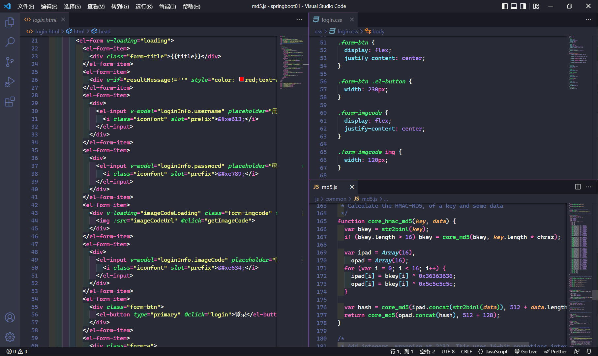
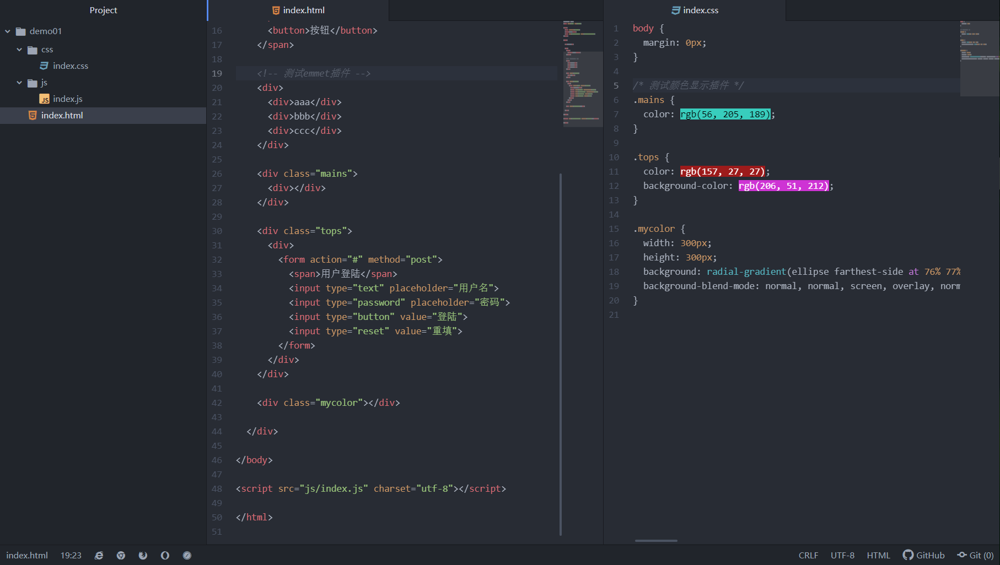
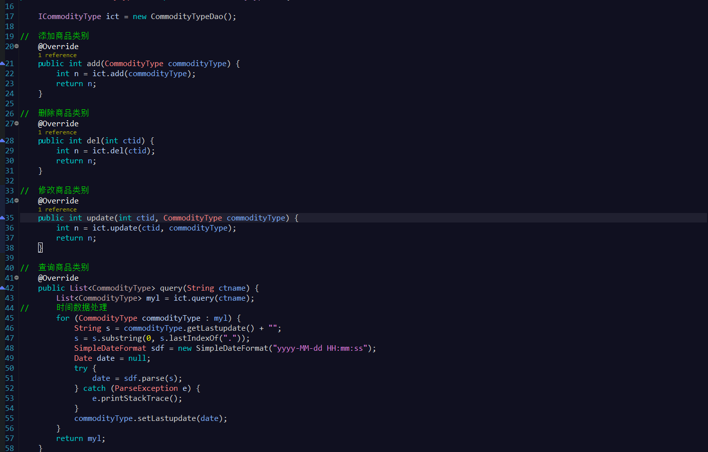
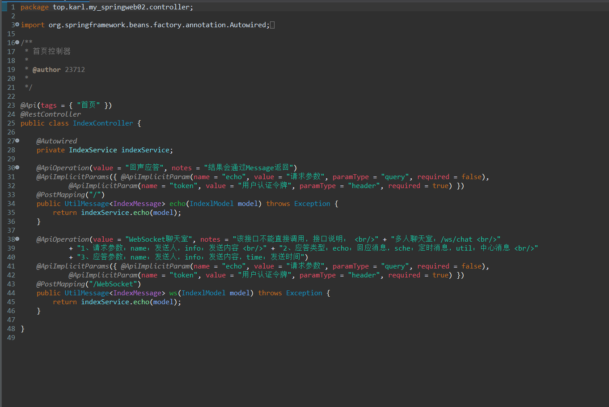
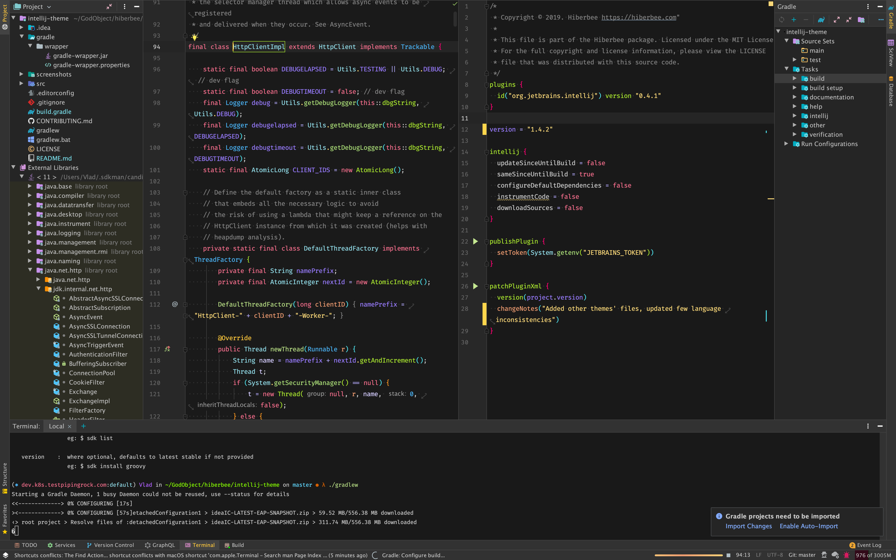
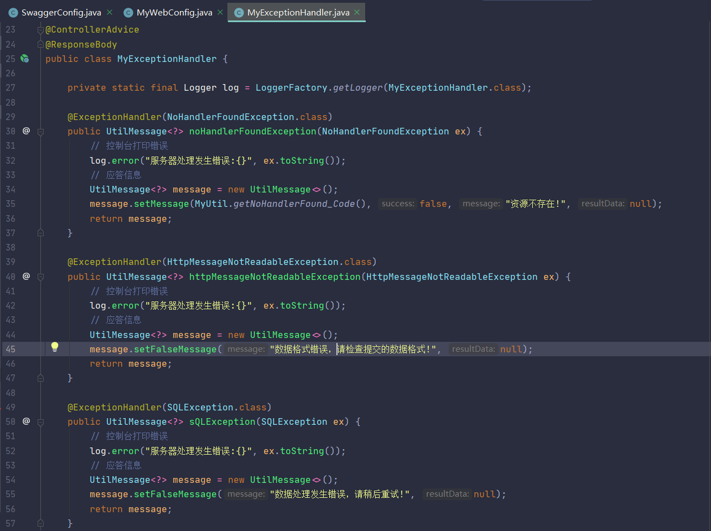

# karl-计算机学习知识点

- [大一](https://code.aliyun.com/kangxianghui/studywrod/tree/master/%E5%A4%A7%E4%B8%80%E5%AD%A6%E4%B9%A0%E7%9F%A5%E8%AF%86%E7%82%B9/web)
- [大二](https://code.aliyun.com/kangxianghui/studywrod/tree/master/%E5%A4%A7%E4%BA%8C%E5%AD%A6%E4%B9%A0%E7%9F%A5%E8%AF%86%E7%82%B9)
- [大三](https://code.aliyun.com/kangxianghui/studywrod/tree/master/%E5%A4%A7%E4%B8%89%E5%AD%A6%E4%B9%A0%E7%9F%A5%E8%AF%86%E7%82%B9/README.md)
- [公开项目--git链接](https://code.aliyun.com/kangxianghui/studywrod/tree/master/project%20link)
- [*黑暗骑士的网站*](https://huhuiyu.top/)
- [*我的个人主页*](https://kangxianghui.top)

## 个人推荐

### 一、前端--IDE

- 1、**VsCode**  
[--回到顶部--](#karl-计算机学习知识点)  
- 推荐主题：`Dracula Official`  
  
- 2、**Atom**  
[--回到顶部--](#karl-计算机学习知识点)  
- 推荐主题：`One Dark`  
  

### 二、后端--IDE

- 1、**MyEclipse**  
[--回到顶部--](#karl-计算机学习知识点)  
- Eclipse主题网站：[http://www.eclipsecolorthemes.org/](http://www.eclipsecolorthemes.org/)  
- 推荐主题：`RecognEyes`  
  
- 2、**Spring Tool Suite**  
[--回到顶部--](#karl-计算机学习知识点)  
- 推荐主题：`Dark`  
  
- 3、**IntelliJ IDEA**  
[--回到顶部--](#karl-计算机学习知识点)  
- Jetbrains主题网站：[https://plugins.jetbrains.com/search?tags=Theme](https://plugins.jetbrains.com/search?tags=Theme)  
- 推荐主题：  
  - (1)、`Hiberbee Theme`  
  
  - (2)、`Coderpillr Theme`  
  
[--回到顶部--](#karl-计算机学习知识点)  
