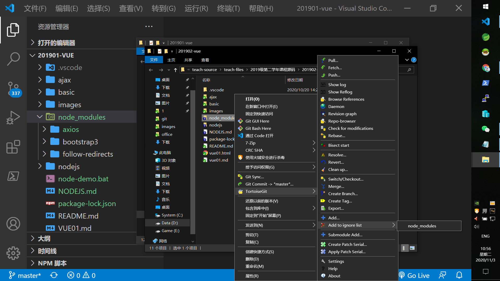

# notde js和vuecli

- [node js官方](https://nodejs.org/en/)
- 检查是否安装
  - 按`Ctrl + ~`打开终端
  - 执行`node -v`查看是否安装成功(显示版本号)
  - 执行`npm -v`查看npm版本号
- nodejs其实可以简单的理解为将JavaScript语言扩展成可以  
编写桌面应用
  - 1: 编写js代码
  - 2: 执行`node js文件`启动js程序
- npm是nodejs编写的软件包管理程序，用于下载nodejs编写的软件
- npm的安装源是国外的服务器，下载会非常的不稳定，所以需要配置  
成阿里提供的安装源
  - 执行`npm config get registry`查看安装源
  - 执行`npm config set registry "https://registry.npm.taobao.org/"`设置成阿里的安装源
- 通过npm安装资源
  - npm执行安装后，项目目录里面会多出一个`node_modules`目录
  - 如果项目是git管理的，切记不要提交该目录！！！
  - 演示安装bootstrap3
    - 执行`npm install bootstrap3` 
    - 下载完后的文件不要上传git(文件数量太多)，可以选择忽略：

- win10的增强命令行(powershell)
  - 按`win + s`打开系统搜索
  - 输入`powershell`后在结果界面选powershell应用~
  - 一些简单的指令
    - `盘符：`: 切换命令所在盘，例如`d:`
    - `pwd`: 显示当前所在文件路径
    - `start .`: 打开当前所在文件路径
    - `ls`: 查看当前路径中的文件/文件夹列表
    - `cd 文件完整绝对路径/相对路径`: 切换当前所在文件路径
  - 允许powershell执行远程脚本的能力
    - 执行`get-ExecutionPolicy`查看执行脚本的权限
    - 执行`set-ExecutionPolicy RemoteSigned`修改权限，  
      该指令需要管理员身份打开powershell才能执行